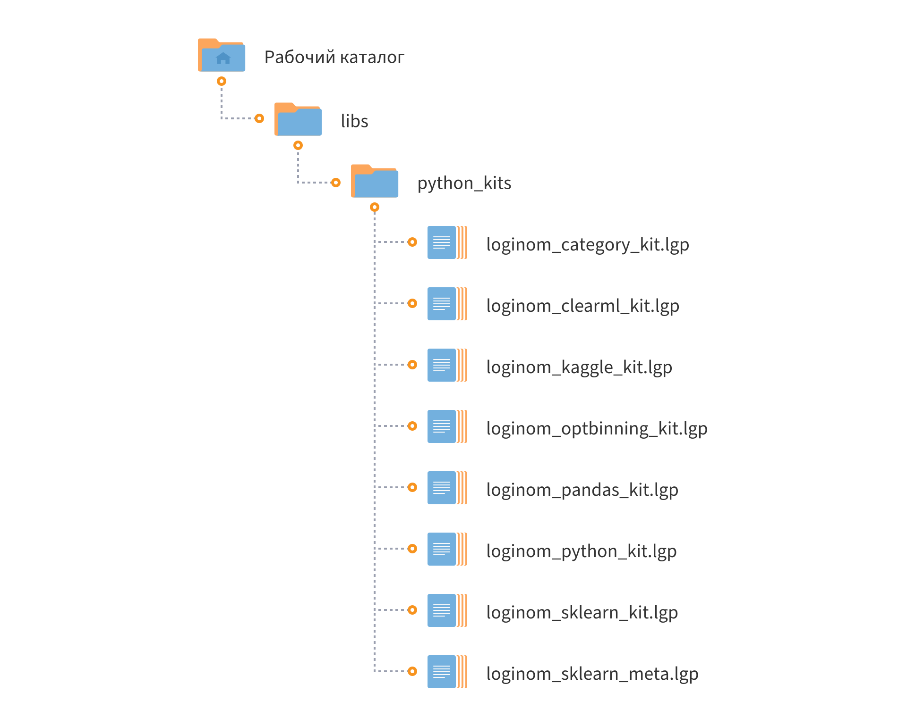

# Loginom Python Kits

* Версия: 3.1.0
* Проверено: Все редакции Loginom 7.1.0

Набор библиотек компонентов для работы с Python. Область применения библиотек:

* рутинные операции с наборами данных, расширяющие стандартный функционал Loginom;
* быстрый перенос существующего кода на Python (pandas, sklearn) в Loginom, используя no-code подход;
* разработка универсальных шаблонов сценариев Loginom, которые будут работать на любом наборе данных;
* внедрение в сценарий модели машинного обучения из библиотек на Python.

## Общие требования:

1. Установленный на сервере или локальной машине Python версии не ниже 3.9.
2. Указать в настройках Loginom путь к библиотеке **python3x.dll**.
3. Разрешить выполнение узлов Python.

Подробности можно найти в справочной системе Loginom.
Для работы с конкретной библиотекой **kit** требуется установить соответствующую библиотеку в Python. Эти требования приводятся в разделе, посвященной конкретной библиотеке.

## Установка

1. Определите рабочий каталог, где будут расположены ваши библиотеки:

   * Для серверных редакций — в рабочем каталоге Loginom Server (в папке пользователя или в общей папке пользователей);
   * Для настольных редакций — в любой папке на локальном диске.

2. Создайте в нем подкаталог **libs**.

3. Разместите папку **python_kits** в каталоге **libs**.

## Список библиотек

1. `loginom_python_kit.lgp` — библиотека с общими компонентами, расширяющими стандартный функционал Loginom.

> **Требования:** установленная python-библиотека [Pandas](https://pandas.pydata.org/) версии не ниже 1.5.0.

2. `loginom_pandas_kit.lgp` — библиотека с рядом компонентов, вызывающих функции по манипуляции датасетами из Pandas.

> **Требования:** установленная python-библиотека [Pandas](https://pandas.pydata.org/) версии не ниже 1.5.0.

3. `loginom_sklearn_kit.lgp` — библиотека с компонентами для обучения и прогона алгоритмов и моделей, доступных в библиотеке [Scikit-learn](https://scikit-learn.org/).

> **Требования:** установленная python-библиотека  [Scikit-learn](https://scikit-learn.org/) версии 1.1 и выше.

4. `loginom_optbinning_kit.lgp` — библиотека с компонентами для оптимального квантования из библиотеки [OptBinning](https://gnpalencia.org/optbinning/).

> **Требования:** установленная Python-библиотека OptBinning версии 0.17.0 и выше.

>`Внимание!` Библиотека требует установки других python-библиотек определенных версий: numpy, ortools, pandas и другие, а также компонентов Microsoft Visual C++ 14.0. Подробности в документации к OptBinning [здесь](https://github.com/guillermo-navas-palencia/optbinning/blob/master/README.rst).

5. `loginom_category_kit.lgp` — библиотека с компонентами для кодирования категориальных признаков из библиотеки [CategoryEncoders](https://contrib.scikit-learn.org/category_encoders/)

> **Требования:** установленная Python-библиотека Category Encoders версии 2.6.0 и выше.

## Прочее

1. `loginom_sklearn_meta.lgp` — пакет с метакомпонентами библиотеки Sklearn Kit. Содержит готовые настроенные компоненты с параметрами для обучения ML-модели компонентом **model.fitter**, а также другие метакомпоненты.

## Cписок компонентов библиотеки **Loginom Python Kit**

### **utils**

* [Редкие значения](./docs/rare-values.md)
* [Редкие значения (прогон)](./docs/rare-new-values.md)

## Cписок компонентов библиотеки **Loginom Pandas Kit**

### **Data manipulations**

* [corr](./docs/corr.md)
* [melt](./docs/melt.md)
* [pivot_table](./docs/pivot-table.md)
* [get_dummies](./docs/get-dummies.md)

## Cписок компонентов библиотеки **Loginom Sklearn Kit**

### **general**

* [simple.fitter](./docs/simple-fitter.md)
* [model.fitter](./docs/model-fitter.md)
* [model.scorer](./docs/model-scorer.md)
* [model.properties](./docs/model-properties.md)

### **sklearn.metrics**

* [classification metrics](./docs/classification-metrics.md)
* [clustering metrics](./docs/clustering-metrics.md)
* [regression metrics](./docs/regression-metrics.md)
* [roc_auc_score](./docs/roc-auc-score.md)
* [roc_curve](./docs/roc-curve.md)
* [r2_score](./docs/r2-score.md)
* [average_precision_score](./docs/average-precision-score.md)
* [silhouette_score](./docs/silhouette-score.md)
* [silhouette_samples](./docs/silhouette-samples.md)

## Cписок компонентов библиотеки **Loginom OptBinning Kit**

### **BinningProcess**

* [binning_process.fitter](./docs/binning-process-fitter.md)
* [binning_process.scorer](./docs/binning-process-scorer.md)

## Cписок компонентов библиотеки **Loginom Category Kit**

### **Category Encoders**

* [Загрузить конфиг](./docs/load-config.md)
* [Сохранить конфиг](./docs/save-config.md)
* [BaseN Encoder](./docs/basen-encoder.md)
* [Binary Encoder](./docs/binary-encoder.md)
* [CatBoost Encoder](./docs/catboost-encoder.md)
* [Count Encoder](./docs/count-encoder.md)
* [Helmert Encoder](./docs/helmert-encoder.md)
* [Leave-One-Out Encoder](./docs/leave-one-out-encoder.md)
* [OneHot Encoder](./docs/onehot-encoder.md)
* [Ordinal Encoder](./docs/ordinal-encoder.md)
* [Polynomial Encoder](./docs/polynomial-encoder.md)
* [Quantile Encoder](./docs/quantile-encoder.md)
* [Target Encoder](./docs/target-encoder.md)
* [WOE Encoder](./docs/woe-encoder.md)

## Список производных компонентов пакета **Loginom Sklearn Meta**

* [cluster.KMeans](./docs/cluster-kmeans.md)
* [ensemble.GradientBoostingClassifier](./docs/ensemble-gradient-boosting-classifier.md)
* [ensemble.IsolationForest](./docs/ensemble-isolation-forest.md)
* [ensemble.RandomForestClassifier](./docs/ensemble-random-forest-classifier.md)
* [ensemble.RandomForestRegressor](./docs/ensemble-random-forest-regressor.md)
* [ensemble.ExtraTreesRegressor](./docs/ensemble-extra-trees-regressor.md)
* [linear_model.LogisticRegression](./docs/linear-model-logistic-regression.md)
* [neighbors.KNeighborsClassifier](./docs/neighbors-kneighbors-classifier.md)
* [neighbors.LOF Novelty](./docs/neighbors-lof-novelty.md)
* [neighbors.LOF Outlier](./docs/neighbors-lof-outlier.md)
* [neighbors.LOF Scorer](./docs/neighbors-lof-scorer.md)
* [preprocessing.Scaler](./docs/preprocessing-scaler.md)
* [meta-scaling](./docs/metascaling.md)
* [meta-silhouettes](./docs/meta-silhouettes.md)
* [meta-silhouettes-score](./docs/meta-silhouettes-score.md)
* [meta-feature-importances](./docs/meta-feature-importances.md)
* [template.fitter](./docs/template-fitter.md)
* [template.scorer](./docs/template-scorer.md)
