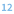

# Мета-данные компонентов

[Назад к списку компонентов](../README.md)

## Назначение

Компонент предназначен для парсинга узлов и подмоделей для получения структуры данных входных и выходных портов. Для корректного парсинга у узлов и подмоделей должна быть отключена автосинхронизация у входных и выходных портов.

## Входные порты

| Название                | Тип        |
|:------------------------|:-----------|
| Настройки               | Переменные |
| Список узлов            | Таблица    |

### Переменные в порте "Настройки"

| №  | Метка                       | Тип                                   | Значение по умолчанию  |
|:---|:----------------------------|:--------------------------------------|:-----------------------|
| 1  | Директория пакета           |  Строковый       |null                    |
| 2  | Имя пакета                  |  Строковый       |null                    |
| 3  | Номер модуля                |  Целый          |1                       |

1. **Директория пакета** — если вы работаете на серверной версии, то необходимо указать папку пользователя на **UserStorage** и папку, если она есть, где хранится пакет, например: `/user/название_папки/`. Слэш в конце обязателен. Если вы работаете на настольной версии, то необходимо указать полный путь к папке. Если переменная пустая, то по умолчанию используется директория текущего пакета.

2. **Имя пакета** — необходимо указать название пакета вместе с расширением, например `Package.lgp`.

3. **Номер модуля** — если значение переменной `null`, `0`, `1`, то обрабатывается первый модуль пакета. При необходимости можно указать номер другого модуля.

### Структура таблицы "Список узлов"

| Метка                | Тип                                        |
|:---------------------|:-------------------------------------------|
| Метка узла           |  Строковый            |
| Служебное имя узла   |  Строковый            |
| Guid узла            |  Строковый            |

## Выходные порты

| Название                 | Тип        |
|:-------------------------|:-----------|
| Структура компонентов    | Таблица    |

### Структура таблицы "Структура компонентов"

| Метка                | Тип                                        |
|:---------------------|:-------------------------------------------|
| Метка узла           |  Строковый            |
| Служебное имя узла   |  Строковый            |
| Guid узла            |  Строковый            |
| Входные порты        |  Строковый            |
| Выходные порты       |  Строковый            |